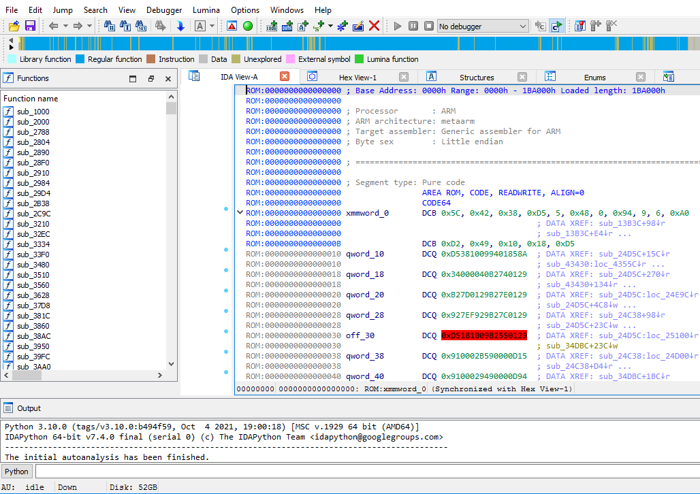

## pixel_loader

This is an IDA Pro loader, that can help improve the process of reversing the ABL stage of the Pixel phone bootloader.

Tested on bootloaders from:

  * Pixel 6 / 6 Pro and 6a
  * Pixel 7 / 7 Pro
  * Pixel 8 / 8 Pro

NOTE: currently the loader doesn't support some of the changes added to the ABL since June 5th 2024, It'll be fixed later.

### Installation

Simply copy the script to the following path:
```
$IDAPRO/loaders/
```

Where $IDAPRO is the folder/directory where the ida executable is located.
For example on Windows that would be something like ```C:\Program Files\IDA Pro 8.3\loaders\```

Afterwards, whenever a pixel ABL is loaded into ida pro, the loader module will show up in the options, simply click ok.


So, far the loader will help with:
  - Finding the function table (containing offests of where the functions .
  are, their size and an offset to their name as null-terminiated string).
  - Creating some C-style structs and applying.
  - Marking interesting areas in the bootloader binary.

It will be updated later to include improved function types/identifying embedded objects...etc to help in reverse engineering and research.

### Example

Before the loader IDA pro tries to auto-guess where the valid instructions are (This image is from IDA Pro 8.3) and normally its invalid


After the loader has been installed, this is the results:


PS: the labeling/translation of operands in MRS/MSR instructions is done by this plugin:

https://github.com/NeatMonster/AMIE
